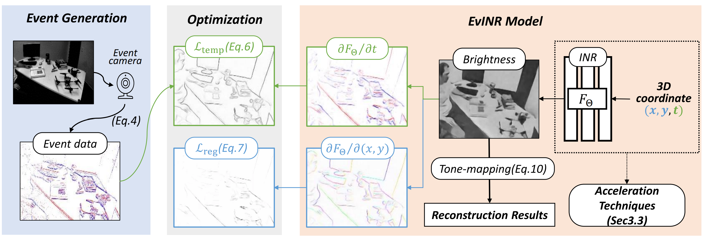

# Revisit Event Generation Model: Self-Supervised Learning of Event-to-Video Reconstruction with Implicit Neural Representations (ECCV2024)
### [Project Page](https://vlislab22.github.io/EvINR/) | [Paper](https://arxiv.org/abs/2407.18500)
[](https://colab.research.google.com/drive/1pYlZ9UU1nsB1XIUc25jZD7z_97pGssQg?usp=sharing)<br>

[Zipeng Wang](https://scholar.google.com/citations?user=3w7X6NYAAAAJ),
[Yunfan Lu](https://scholar.google.com/citations?user=nPUR_0sAAAAJ),
[Addison Lin Wang](https://vlislab22.github.io/vlislab/linwang.html)<br>
The Hong Kong University of Science and Technology (Guangzhou).

This is the official implementation of the paper "Revisit Event Generation Model: Self-Supervised Learning of Event-to-Video Reconstruction with Implicit Neural Representations" .

## Abstract

*Reconstructing intensity frames from event data while maintaining high temporal resolution and dynamic range is crucial for bridging the gap between event-based and frame-based computer vision. 
Previous approaches have depended on supervised learning on synthetic data, which lacks interpretability and risk over-fitting to the setting of the event simulator. 
Recently, self-supervised learning (SSL) based methods, which primarily utilize per-frame optical flow to estimate intensity via photometric constancy,  has been actively investigated. However, they are vulnerable to errors in the case of inaccurate optical flow.
This paper proposes a novel SSL event-to-video reconstruction approach, dubbed EvINR, which eliminates the need for labeled data or optical flow estimation.
Our core idea is to reconstruct intensity frames by directly addressing the event generation model, essentially a partial differential equation (PDE) that describes how events are generated based on the time-varying brightness signals.
Specifically, we utilize an implicit neural representation (INR), which takes in spatiotemporal coordinate (x, y, t) and predicts intensity values, to represent the solution of the event generation equation. 
The INR, parameterized as a fully-connected Multi-layer Perceptron (MLP), can be optimized with its temporal derivatives supervised by events.
To make EvINR feasible for online requisites, we propose several acceleration techniques that substantially expedite the training process. 
Comprehensive experiments demonstrate that our EvINR surpasses previous SSL methods by 38% w.r.t. Mean Squared Error (MSE) and is comparable or superior to SoTA supervised methods.*

## Google Colab
<!-- If you want to do a quick test with EvINR, we have written a [Colab](https://colab.research.google.com/drive/1pYlZ9UU1nsB1XIUc25jZD7z_97pGssQg?usp=sharing) with minimal implementation, which can be viewed online (which means you don't have to install anything!) -->
If you're interested in trying EvINR but want to avoid the hassle of installation, we've got you covered. Check out our [Colab notebook](https://colab.research.google.com/drive/1pYlZ9UU1nsB1XIUc25jZD7z_97pGssQg?usp=sharing) for a straightforward and quick test run. It's all ready for you to use online!

## Overview
This repository is organized as follows:

* event_data.py: Loads event data and stacks them into event frames.
* model.py: Contains our neural network solver for event-based video reconstruction.
* utils.py: Contains utility functions for event data manipulation and visualization.
* train.py: Contains the training routine.
* scripts/: Converts common event datasets into formats used in our work.

## AED Dataset
If you are interested in our ALPIX Event Dataset (AED), please contact wzpscott@gmail.com.

## Data Preparation
We currently provide conversion scripts for the following datasets: [IJRR](https://rpg.ifi.uzh.ch/davis_data.html), [HQF](https://drive.google.com/drive/folders/18Xdr6pxJX0ZXTrXW9tK0hC3ZpmKDIt6_), and [CED](https://rpg.ifi.uzh.ch/CED.html). Our AED dataset does not require further conversion.

To process your own dataset, please convert the event data into a numpy array with the shape $[N \times 4]$, where N is the total number of events. The properties of each event should be in the order of $(t, x, y, p)$.

## Training
We provide the example commands to train EvINR on different dataset.

### IJRR and HQF
```
python train.py -n EXP_NAME -d DATA_PATH --H 240 --W 180
```

### CED
```
python train.py -n EXP_NAME -d DATA_PATH --H 260 --W 346 --color_event
```

### AED
```
python train.py -n EXP_NAME -d DATA_PATH --H 408 --W 306 --event_thresh 0.25
```


## Citation
If you find our work useful in your research, please cite:
```
@article{wang2024EvINR,
  title={Revisit Event Generation Model: Self-Supervised Learning of Event-to-Video Reconstruction with Implicit Neural Representations},
  author={Wang, Zipeng and Lu, Yunfan and Wang, Lin},
  journal={ECCV},
  year={2024}
}
```

## Contact
If you have any questions, please feel free to email the authors or raise an issue.

## Acknowledgments
Our code follows the awesome [Siren](https://github.com/vsitzmann/siren/) repository. We thanks them for the inspiring work.